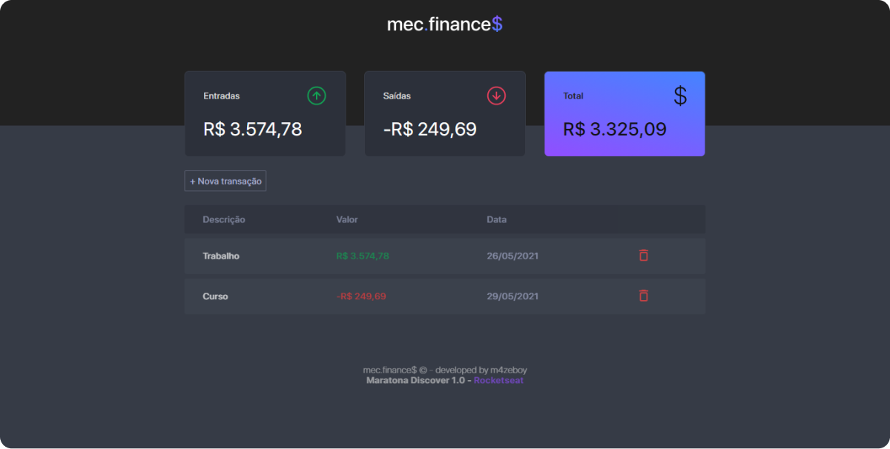

# 🚀 MARATONA DISCOVER by ROCKETSEAT

Aplicação para controle de finanças - **mec.finance$** - Desenvolvida usando apenas HTML CSS e JS.

Foi uma sequência de aulas para aplicar os conhecimentos teóricos passados nos cursos do Discover.

## 💻 Sobre a aplicação

O dev.finances é um programinha para ajudar as pessoas no controle de suas finanças. 
**As principais funções da aplicação são:**

* Adcionar transações de despesas ou entradas;
* Ver as depesas e entradas;
* Ver o total;
* E em formato de tabela conseguir visualizar cada transação separadamente;
* Excluir uma transação;
* Acompanhar a alteração dos valores ao vivo.

## 😎 Deixando com a minha cara

O layout inicial é bem legal, mas eu quis dar um toque no projeto para deixá-lo mais parecido comigo.
**Aqui abaixo vou listar as alterações que eu fiz (talvez eu não lembre de todas):** 

* Eu mudei o logo e o nome da aplicação para **"mec.finance$"** - *mec é uma gíria*.
* Reformulei a paleta de cores;
* Alterei a fonte;
* Mudei alguns ícones;
* Adcionei mensagens de erros e de sucesso;

## Prévia

